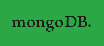
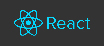

  

 

  <strong>Tomás Guerineau - Full Stack Web Developer - The MERN stack</strong>

 
 

 
 
 
 
<!-- # About me -->
<h1>About me</h1>
 
I am Tomás Guerineau, a lover of programming, marketing and football. Currently I work with the MERN stack (Mongodb, Express, React, Node) and I am always open to implement new technologies. I strive to improve my English and to learn everything necessary to continue growing as a professional.
 
 
<!-- ## languages -->
<h2>Languages</h2>

<b>Spanish</b> - Native language

<b>English</b> - Basic level

 
<!-- ## Skills -->
<h2>Skills</h2>
 

 
 
 
 
<h2>Education</h2>
<li><b>Full Stack Course - Rolling Code</b> - Complete - 2020 - 2021</li>
  
 The MERN Stack (Mongodb, Express, React, Node) / HTML5 - CSS3 - JavaScript (ECMAScript 6 - OOP) 

  <a href="https://desafio-final-beta.vercel.app/"> Final project </a>
  
 100% dynamic e-commerce, built with React and Express. 

 
  <li><b>Higher Technique in Programming - UTN</b> (The National Technological University)</li>
  
 40% of the university degree completed - 2018 

 
  <li><b>Architect - FAU of the UNT</b> (The National University of Tucumán)</li>
  
 Carried out up to 3rd year - 2013 - 2017 

 
 
<!-- ## work experience -->
<h2>Work experience</h2>
 

<b>Freelancer</b> creating web pages for companies and ventures. 

<ul>
  <li><a href="http://ctlargentinaconstructora.com/">ctlargentinaconstructora.com</a></li>
  <li><a href="https://www.exelsusoncologia.com/">exelsusoncologia.com</a></li>
  <li><a href="http://clicmarketingdigital.com.ar/">clicmarketingdigital.com.ar</a></li>
  <li><a href="https://groov.vercel.app/">Groove Episodes</a></li>
</ul>
 

<b>Freelancer</b> performing tasks in the Graphic Design and Marketing sector for companies and entrepreneurs. 

<ul>
  <li> Clic Marketing Digital - 2018 - 2019 </li>
  <li> La Compañía Digital - 2019 - 2020 </li>
</ul>
 

<!--
**tomasgueri/tomasgueri** is a ✨ _special_ ✨ repository because its `README.md` (this file) appears on your GitHub profile.

Here are some ideas to get you started:

- 🔭 I’m currently working on ...
- 🌱 I’m currently learning ...
- 👯 I’m looking to collaborate on ...
- 🤔 I’m looking for help with ...
- 💬 Ask me about ...
- 📫 How to reach me: ...
- 😄 Pronouns: ...
- ⚡ Fun fact: ...
-->
